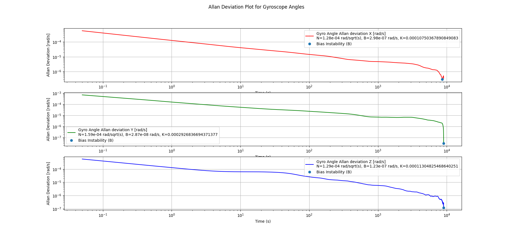
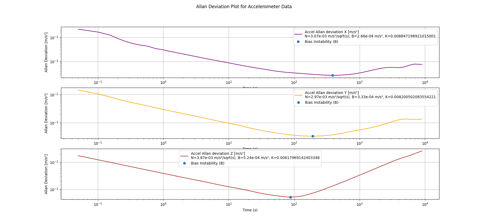

# IMU-Driver
This is a IMU ROS Driver package for VN-100 IMU/AHRS


---
## The File Structure

### imu/analysis
This folder contains the code for the analysis of the IMU data.
### imu/analysis/output
This folder contains the output files of the analysis.
### imu/Report and Analysis
This folder contains the report and analysis of the assignment.
### imu/data
This folder contains the ROS bag file of the imu data published as ros topic imu.
### imu/src/vn_driver/python
This folder contains the code for the ROS driver of the IMU.
### imu/src/vn_driver/launch
This folder contains the launch files for the ROS driver.
### imu/src/vn_driver/msg
This folder contains the Custom IMU message definition for the ROS driver.

---

## Results of Analysis

Allan Variance Gyro:


Allan Variance Accel:


For Detailed analysis refer to [Analysis Report](analysis/Report%20and%20Analysis/Report.pdf)

## Running the Node

You can run the imu driver in two main ways:

### 1. Using the Launch File with the Default Port

To start the node with the default USB port, use the following command:

The default port is USB0

```bash
roslaunch vn_driver standalone_driver.launch
```

### 2. Overriding the Port Argument in the Launch File

If you want to specify a different USB port, you can override the port argument like this:

```bash
roslaunch vn_driver standalone_driver.launch port:=/dev/ttyUSB1
```

### 3. Running the Script Directly

You can also run the script directly and specify the port as a command-line argument:

terminal 1

```bash
roscore
```

terminal2 

```bash
rosrun vn_driver standalone_driver.py /dev/ttyUSB1
```

or 

```bash
python3 standalone_driver.py /dev/ttyUSB1
```

---

### Running the analysis scripts

To run the analysis scripts, navigate to the `analysis` folder and run the following commands:

#### One the terminal from the analysis folder and run all the analysis scripts

To run the entire imu analysis and view it separate plot and all the plots data combined together

```bash
python3 imu_analysis_separate_plots.py
```

To run the entire imu analysis and view it sub plots

```bash
python3 imu_analysis_sub_plots.py
```

Since the file size of the imu ros bag data is large, so it is recommended to convert the imu ros bag data to csv file first and then run the analysis scripts. To convert the imu ros bag data to csv file, you can use the following command:

The below step can be skipped as it is already done and csv file is already present in the data folder

```bash
python3 csv_writer.py
```

To view the allan variance plot

```bash
python3 allan_analysis.py
```
#### Note allan variance will take tike to display the plot as the data set is very large. wait for 5-10 minutes to see the plot.

---
